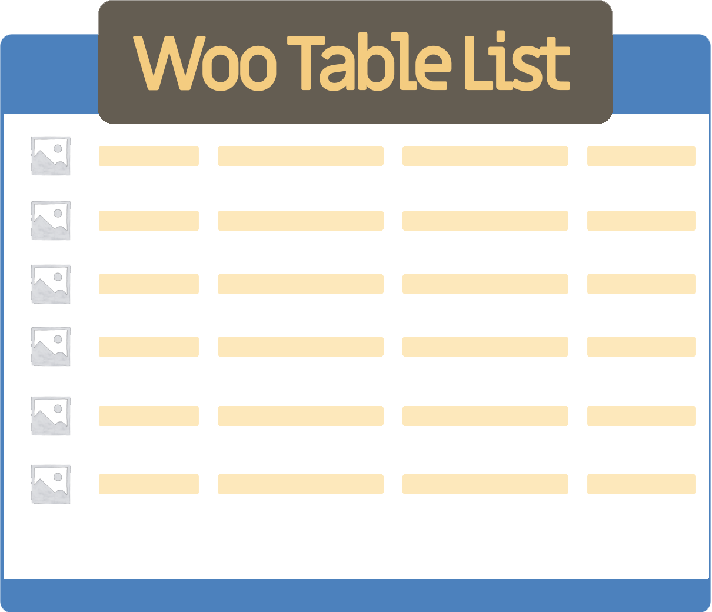
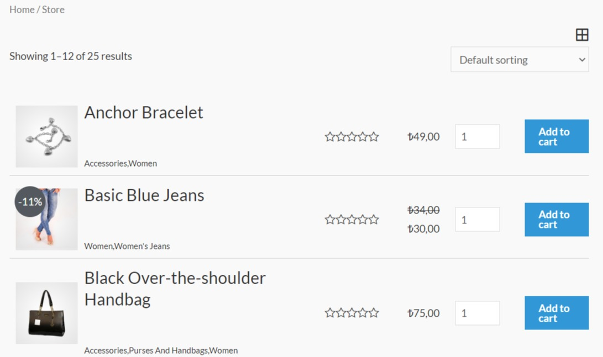
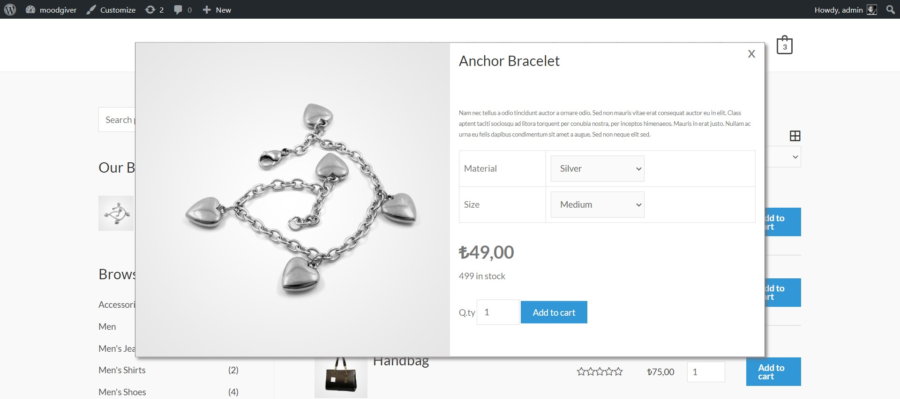

# Woo Table List

*Beta 1.0.0*

Woo Table List is a WooCommerce plugin that adds a table list view to your online shop pages.

Woo Table List has been tested with the following themes : **Astra** , **OceanWP**


### Requirements: 

- Wordpress 5.3 
- WooCommerce 4

## Installation

***This is a beta version not ready for production. Install in a development environment.***

Download ZIP file from this repository and install in a wordpress development environment.


## Notice

**Woo Table List doesn't change or override any current template of your theme. It's based on JavaScript and CSS functionalities in order to manipulate the output to render a table like view.**

## Output 

**Shop Page**




**Variable Product Add To Cart Modal**




## Features

- Easy settings
- Table view live rendering
- Works for Shop, Product Category, Related products
- Switch from Woo Table List view to the current theme template without page reloading
- Access to Product variations thru a modal popup so users can order directly from the shop page with no page reloading
- Available Product fields/elements display filter :
    - Image
    - Product name
    - Categories
    - Rating
    - Price
    - Quantity
    - Sale tag
    - Add to cart button
    - Custom Meta Field (will be displayed below product name)
    - Product excerpt (only in the modal)
- Drag & Drop Fields order
- Full Ajax Add to cart support
- Responsive output

## Settings
Go to Woo Table List admin page
You will find 3 settings tabs

### Settings > Main


- **Enable Woo Table List** : this activates the Woo Table List view for your shop
- **Woo Table List default view**: set Woo Table List as default view
- **Enable switch view**: you can also give the visitor the possibility to switch from your theme default view to Woo Table List view
- **Enable Variations Selection**: this options create a modal window for variable products activated by the Add to cart / Select options from the Woo Table List view. In this way visitor don't need to go to the product page, but they can order directly from the current page
- **Sale tag**: enable sale tag for products on sale. In the customize section you can set a value of % in order to show the discount percentage
- **Show excerpt**: will show the product excerpt in the modal window (for variable products) 
- **Thumbnail zoom**: enable thumbnail mouseover to show a larger preview of the product image

   
### Settings > Layout

Use this section to define your table/list layout.

- **Drag&Drop** the available fieds to the desired column. You can assign multiple fields to the same column.
- **DblClick** to remove a field
- **Drag&Drop Column** to move a column or to delete dragging in the below area

### Settings > Customize

Available customizations:

- **Add to cart** button text
- **Go to cart** : Go to Cart button text (used for variable products, after product has been added to cart)
- **Added to cart** : Message displayed when a product has been added to cart. Your setting:
_product_name_ added to cart
- **Select options text** : change Select options button text when a product is variable
- **Sale tag text** : change the sale tag text. Input **%** to show the discount percent
- **Add Meta fields** : you can add to table list meta/custom fields. Input custom fields names separated by comma


## Style customization

Woo Table List depends mostly on the theme style so normally you don't need to change the plugin style. 

If you need to change some style add your custom CSS using the available classes of the Woo Table List output.

You can find all the classes used in : 

```wp-content/plugins/woo-table-list/public/css/woo-table-list.css```

***Do not change the above CSS file. Any change can break the plugin output. Also when plugin is updated your change will be overwritten***

